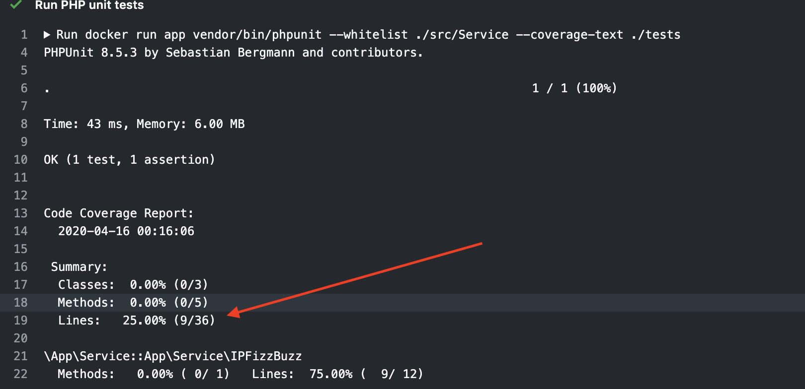

# Treinando Unit tests em PHP

Esse repositório contém uma pequena aplicação que descobre o seu IP
e diz qual a sua localizacao baseado no IP. Leia o arquivo [getIp.php](./getIp.php) para
entender como a aplicação funciona.

Além disso, o repositório serve como um exercício para uma série de vídeos que eu produzi para a Youtube sobre testes automatizados. 
Você pode ver o primeiro vídeo sobre testes unitários com PHPUnit [aqui](https://www.youtube.com/watch?v=G8SNRbZSRNw&list=PLzehOqhpwpxjs8bfI72dR-wV-7ZGxfuTN&index=4). 

## Como instalar e rodar tests

```bash
./composer.phar install
./vendor/bin/phpunit --colors tests
```

## Objetivo

Faça um fork ❤️. 
Seu objetivo é criar testes para todas as classes `App\Service`. Siga o documento [Guide.md](Guide.md) para saber a melhor ordem de estudo.
Cada teste cobre partes das suas classes `App\Service`, o objetivo seria chegar a 100% de cobertura para fins de estudo. Você pode acompanhar sua porcentagem de cobertura através da pagina do [github actions](https://github.com/cloudson/treinando-unit-tests-php/actions).



Se você quiser rodar o projeto e ver cobertura na sua maquina local, o modo mais fácil é via docker. 

```
docker build . -t app 
docker run app vendor/bin/phpunit --whitelist ./src/Service --coverage-text --colors ./tests
```
## Respostas 

Eu extremamente recomendo a você não olhar as respostas. São apenas três classes para cobrir de testes, e eu sei que você consegue 😉. Quando você olha as respostas e se baseia nelas para estudar, você tem uma falsa sensação de evolução. Se você terminou e quer checar mesmo assim, basta ir [até a branch respostas](https://github.com/cloudson/treinando-unit-tests-php/tree/respostas). 

## E Depois? 
Se divertiu? Que tal estudar com outros tipos de desafios com solução em vídeo? Acesse [devgym.com.br](https://app.devgym.com.br?utm_campaign=rinhaback&utm_medium=social&utm_source=github). 

[](https://app.devgym.com.br?utm_campaign=rinhaback&utm_medium=social&utm_source=github)


